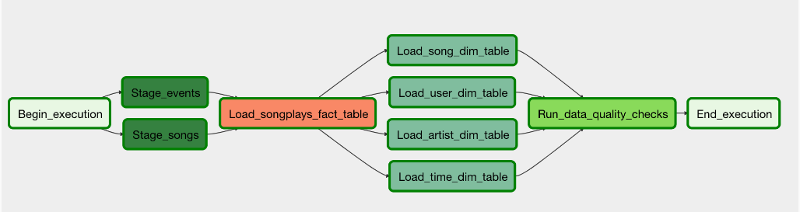
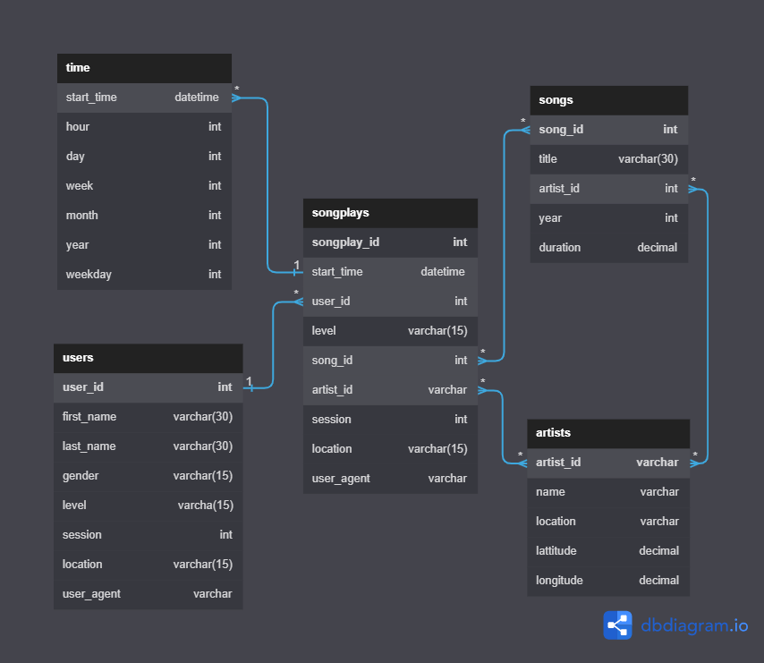

# Sparkify Data Pipelines with Airflow

## Project Overview

Sparkify, a music streaming company, is transitioning to a more automated and monitored approach for their data warehouse ETL (Extract, Transform, Load) pipelines. To achieve this, they've chosen Apache Airflow as the primary tool. This project demonstrates the creation of high-quality data pipelines that are dynamic, reusable, and monitorable, with a focus on data quality. The source data, consisting of JSON logs and song metadata, resides in S3 and is loaded into Sparkify's data warehouse on Amazon Redshift.

## Project Structure

The ETL pipeline is structured as an Airflow DAG (Directed Acyclic Graph) with the following key tasks:

1. **Staging the Data**: Load JSON files from S3 into Amazon Redshift.
2. **Loading Fact Table**: Populate the fact table `songplays`.
3. **Loading Dimension Tables**: Populate dimension tables such as `users`, `songs`, `artists`, and `time`.
4. **Running Data Quality Checks**: Validate the data integrity in the Redshift tables.

## Prerequisites

### AWS Setup
- **IAM User**: Create an IAM user with the necessary permissions for S3 and Redshift.
- **Redshift Cluster**: Set up a Redshift cluster in the `us-west-2` region.

### Airflow Setup
- **Connect Airflow to AWS**: Establish a connection between Airflow and AWS.
- **Connect Airflow to Redshift**: Ensure Airflow can access the Redshift cluster.

### Datasets
- **Log Data**: Available in S3 at `s3://udacity-dend/log_data`.
- **Song Data**: Available in S3 at `s3://udacity-dend/song_data`.

## Project Files

- **DAG Template**: Contains the structure of the DAG, including task templates and dependencies.
- **Operators**: Custom operators for staging data, loading fact and dimension tables, and running data quality checks.
- **Helper Class**: Provides SQL transformations required for the ETL process.

## Airflow DAG Configuration

- **No Dependencies on Past Runs**: Each run is independent.
- **Retries**: Tasks will retry 3 times on failure, with a 5-minute interval between retries.
- **Catchup**: Disabled to prevent backfilling of DAG runs.
- **No Email on Retry**: Notifications are not sent on retry.

## Operators Implementation

### Stage Operator

The `StageToRedshiftOperator` is designed to load JSON files from S3 into Redshift. It constructs and executes a SQL `COPY` command based on parameters such as S3 file location and Redshift target table. The operator supports loading timestamped files and running backfills.

### Fact and Dimension Operators

- **Fact Operator**: Inserts data into the fact table `songplays`. This table is designed to support large-scale append operations.
- **Dimension Operators**: Load data into dimension tables using the truncate-insert pattern, which clears the table before insertion. Parameters can switch between insert modes for flexibility.

### Data Quality Operator

The `DataQualityOperator` runs SQL-based tests to validate the data in Redshift. It checks for conditions such as the presence of NULL values in critical columns. If a test fails, the operator raises an exception, causing the task to retry and eventually fail if the issue persists.

## Schema for Song Play Analysis

#### Fact Table
1. **songplays** - records in event data associated with song plays i.e. records with page ``NextSong``
        songplay_id, start_time, user_id, level, song_id, artist_id, session_id, location, user_agent
#### Dimension Tables
2. **users** - users in the app
        user_id, first_name, last_name, gender, level
3. **songs** - songs in music database
        song_id, title, artist_id, year, duration
4. **artists** - artists in music database
        artist_id, name, location, lattitude, longitude
5. **time** - timestamps of records in **songplays** broken down into specific units
     - start_time, hour, day, week, month, year, weekday

       
